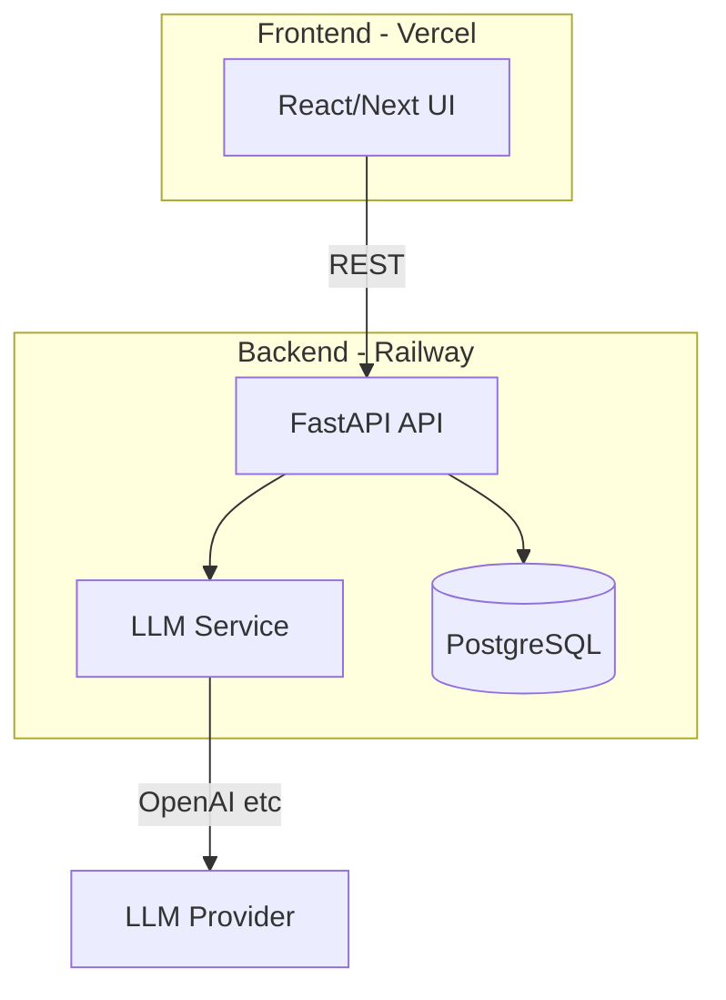

# To-Do App with LLM Priority and Schedule Planning

## Your idea (summary)

- **Tasks:** Detail, due date, frequency, comments/next steps (evolving).
- **Priority help:** LLM considers long-pending, approaching deadlines, financial impact → priority order/category.
- **Chat:** "I have 30 minutes" → LLM suggests tasks from DB using comments/context.
- **Categories:** Focus now / today / week / month / later (and possibly P1/P2/P3).
- **Schedule planning:** General 7-day template (e.g. 5–6 exercise, 6–8 kitchen/breakfast, 8–9 drop daughter). User enters "what I do" per day in free text; app proposes a schedule. Different day types (office, library, Costco, etc.).

---

## Suggestions and decisions

### 1. Priority: time-horizon + importance (recommended)

Use **both** dimensions:

- **Time-horizon (when to look at it):** Focus now → Focus today → Focus this week → Focus this month → Focus later.  
Good for "what to look at first" and for the chat ("I have 30 min").
- **Importance (how critical):** P1 / P2 / P3 (or High / Medium / Low).  
Good for "which of these matter most" and financial/impact reasoning.

LLM can output both: e.g. "Focus this week, P1" or "Focus today, P2". UI can filter/sort by either.

**UI label mapping (design to backend):** Use friendly section names in the UI; store `time_horizon` in the DB. Map as follows so implementation and designs stay aligned:

- **Urgent** (red) to `focus_now` or `focus_today` — "Focus now" / "Focus today"
- **Important** (yellow) to `focus_week` or `focus_month` — "Focus this week" / "Focus this month"
- **Someday** (green) to `focus_later` — "Focus later"

Filter pills: **All**, **P1**, **P2**, **P3**, plus optional tags (e.g. call, financial, health, paperwork, immigration, home, project, family). Task rows show both time-horizon section and importance/tags.

### 2. Schedule vs tasks

- **Tasks:** One-off or recurring to-dos with due dates and steps (e.g. "First-time US tax filing" with many sub-steps).
- **Schedule:** Repeating **time blocks** (e.g. "Mon–Fri 9–10 go to office", "Sat 10–12 library"). No due date; it's your default week template.

So: **Tasks** = what to do; **Schedule** = when you usually do which type of activity. "What should I do with 30 min" can combine both (tasks + current time block).

### 3. Tech stack (Python + deploy on Railway and Vercel)

- **Backend:** Python (FastAPI recommended) — REST API, LLM calls, DB access. Deploy on **Railway**.
- **Frontend:** Two options:
  - **Option A (recommended):** React or Next.js app in a `frontend/` folder, calling the Python API. Deploy frontend on **Vercel**, API on **Railway**. Clear split, good for "30 min chat" and rich UI.
  - **Option B:** Single FastAPI app with Jinja templates + HTMX or minimal JS. Deploy only on **Railway**. Simpler, one codebase; Vercel used only for static assets if needed.
- **Database:** SQLite for local/dev; **PostgreSQL** on Railway for production (same SQLAlchemy models).
- **LLM:** Gemini (Google) behind a thin client interface. Store API key in env (`GEMINI_API_KEY`).

### 4. High-level architecture



---

## UI reference (designs → implementation)

Use these reference screens to implement the frontend; same components can be reused across sections.

| Screen / area             | Design reference                                     | Implementation notes                                                                                                                                                                                                                                                                 |
| ------------------------- | ---------------------------------------------------- | ------------------------------------------------------------------------------------------------------------------------------------------------------------------------------------------------------------------------------------------------------------------------------------ |
| **Main layout**           | FocusFlow dashboard (brand, tabs, completed count)   | Header: app name + "COMPLETED X/Y". Tabs: **Tasks** (default), **AI Chat**, **Week Planner** (or Schedule).                                                                                                                                                                          |
| **Tasks – AI Insights**   | Collapsible "AI INSIGHTS" card on Tasks tab          | LLM-driven summary: deadline risks, batching suggestions, linked tasks. "Chat with AI for more" → opens AI Chat.                                                                                                                                                                     |
| **Tasks – list**          | Urgent / Important / Someday list views              | One list component; sections by time_horizon (Urgent, Important, Someday). Each task row: checkbox, title, tags, **DEADLINE RISK** badge when applicable, expand arrow. Search + filters: All, P1, P2, P3, tags.                                                                     |
| **Task row (expandable)** | Expand chevron on each task                          | Expand to show: due date, frequency, comments/next steps; optional "Prioritize" (re-run LLM for this task).                                                                                                                                                                          |
| **AI Chat**               | AI Chat tab with greeting + suggested prompts        | Opening message summarizes tasks (e.g. "2 urgent deadline risks, several that can be batched"). Buttons: "What should I do today?", "I have 30 minutes – what should I do?", "Batch my tasks", "What's at risk?", "Plan my week". Input: "Ask me anything about your tasks…" + Send. |
| **Week Planner**          | Week Planner with day tabs + "Let AI plan your week" | **Before** "Generate My Week Plan": add "Describe your current week" (one text area per day) and "Desired activities" (tags or list). Then "Generate My Week Plan" uses that + tasks to propose blocks. Day tabs (Mon–Sun); grid of time blocks per day; edit start/end/label.       |

**Task tags:** Support at least `urgent`, `financial`, `immigration`, `health`, `paperwork`, `call`, `home`, `project`, `family` (and user-defined). Show as pills; use for filtering and for LLM context.

---

## Data models (core)

**Task**

- `id`, `detail`, `due_date`, `frequency` (once / daily / weekly / monthly), `comments` (text or JSON for next steps), `created_at`, `updated_at`
- Optional: `importance` (P1/P2/P3), `time_horizon` (focus_now / focus_today / focus_week / focus_month / focus_later) — can be filled by LLM or manually.

**ScheduleBlock (recurring time blocks)**

- `id`, `day_of_week` (0–6), `start_time`, `end_time`, `label` (e.g. "Exercise", "Office"), `notes` (optional), `is_active`

**DayTemplate or UserScheduleInput (for "what I do" and proposal)**

- Store raw free-text per day: e.g. `day_of_week`, `user_description` (long text).  
- LLM reads these + desired activities and outputs a **proposed** set of `ScheduleBlock` rows (user can accept/edit).

**Chat (optional for "I have 30 min")**

- Could be stateless (no history stored) or store last N messages per user for context.

---

## Features in order

### Phase 1: Tasks and basic UI

- CRUD for tasks (detail, due date, frequency, comments).
- **Task list:** Sections by time-horizon (Urgent, Important, Someday). Each task row: checkbox, title, tags; show **DEADLINE RISK** badge when due soon or overdue (backend can compute from due_date). Expandable row (chevron): on expand show due date, frequency, comments/next steps; allow edit.
- List view with search and filter pills: All, P1, P2, P3, and tags (e.g. financial, call).
- No auth for MVP, or simple single-user auth (e.g. session or one API key).

### Phase 2: LLM priority and categories

- "Prioritize" action: send current tasks (and optionally comments) to LLM with instructions: consider overdue, near deadline, financial impact, effort (many steps). Return:
  - Suggested **time_horizon** and **importance** per task (and optionally a sorted list).
- API endpoint that applies LLM output to tasks (update `time_horizon` / `importance`).
- UI: sections "Focus now", "Focus today", "Focus this week", "Focus this month", "Focus later" and/or sort by P1/P2/P3.

### Phase 3: "What should I do now?" chat

- Chat UI + API: user says e.g. "I have 30 minutes free, woke up early."
- **Suggested prompts** (one-click): "What should I do today?", "I have 30 minutes – what should I do?", "Batch my tasks", "What's at risk?", "Plan my week". These pre-fill or send the intent so the LLM can respond with task suggestions or schedule help.
- Backend: load relevant tasks (and optionally current schedule block), send to LLM with instructions to pick a few concrete options (using comments/next steps).
- Return short list of suggested tasks + reasoning; no need to store chat unless you want history.

### Phase 4: Schedule planning

- **Step 1 – Describe current week:** Form with one text area per day of week: "What I do on Monday" (free-flow text). Store as `UserScheduleInput`. This must be available *before* generating a plan so the LLM can use real habits.
- **Step 2 – Desired activities:** List or tags (e.g. office, admin, cook, daughter, kitchen, projects, study AI, exercise, expense tracker, clean, library, Costco). User can select/add what they want to fit into the week.
- **Step 3 – Propose schedule:** "Generate My Week Plan" (or "Plan My Week with AI") sends "current habits" + "desired activities" (+ optional: task deadlines) to LLM; LLM returns a 7-day time-block proposal (e.g. "Mon: 5–6 exercise, 6–8 …").
- **Step 4 – Apply proposal:** Convert LLM output to `ScheduleBlock` rows (draft); user can edit start/end/label per block, then "confirm" to save (replace or merge into schedule).
- **UI:** Week Planner screen with day tabs (Mon–Sun); above the 7-day grid, show the "Describe your current week" inputs and "Desired activities" before the "Generate My Week Plan" button; below, show the resulting blocks per day with inline edit.

### Phase 5: Polish and deployment

- Env-based config (API URL for frontend, DB URL, LLM API key).
- Railway: run FastAPI (e.g. `uvicorn`), attach PostgreSQL.
- Vercel: deploy frontend (Node build), set `NEXT_PUBLIC_API_URL` or equivalent to Railway backend.

---

## File structure (reference)

```
To_Do_App/
├── backend/
│   ├── app/
│   │   ├── main.py           # FastAPI app
│   │   ├── models.py         # SQLAlchemy Task, ScheduleBlock, UserScheduleInput
│   │   ├── schemas.py        # Pydantic
│   │   ├── crud.py           # DB operations
│   │   ├── llm/
│   │   │   ├── client.py     # LLM API wrapper
│   │   │   ├── prioritize.py # priority prompt + parse
│   │   │   ├── chat.py       # "what to do now" prompt
│   │   │   └── schedule.py   # schedule proposal prompt + parse
│   │   └── api/
│   │       ├── tasks.py
│   │       ├── schedule.py
│   │       └── chat.py
│   ├── requirements.txt
│   └── .env.example
├── frontend/                  # If Option A (React/Next)
│   ├── src/
│   │   ├── components/
│   │   ├── pages/
│   │   └── api-client.js
│   └── package.json
└── README.md
```

---

## LLM prompt design (short)

- **Prioritize:** "Given these tasks [list with due date, frequency, comments], assign time_horizon (focus_now/today/week/month/later) and importance (P1/P2/P3). Consider: overdue, deadline proximity, financial impact, number of steps." Output structured (JSON) for easy parsing.
- **Chat:** "User has [context, e.g. 30 min]. Tasks: [relevant tasks + comments]. Suggest 2–3 best options with one-line reason."
- **Schedule:** "User's current week: [free text per day]. Desired activities: [list]. Propose a 7-day schedule with time blocks (start, end, label). Output as JSON."

---

## Summary

| Area              | Recommendation                                                                          |
| ----------------- | --------------------------------------------------------------------------------------- |
| Categories        | Use both: Focus now/today/week/month/later and P1/P2/P3.                                |
| Schedule vs tasks | Tasks = to-dos with due dates; Schedule = recurring time-block template for the week.   |
| Stack             | FastAPI (Railway) + React/Next (Vercel), PostgreSQL, one LLM provider (e.g. OpenAI).    |
| Order             | Tasks CRUD → LLM priority + categories → Chat → Schedule input + LLM proposal → Deploy. |

If you confirm this direction, next step is to implement Phase 1 (backend project, DB models, task CRUD, minimal frontend) and then add LLM and schedule in the order above.
